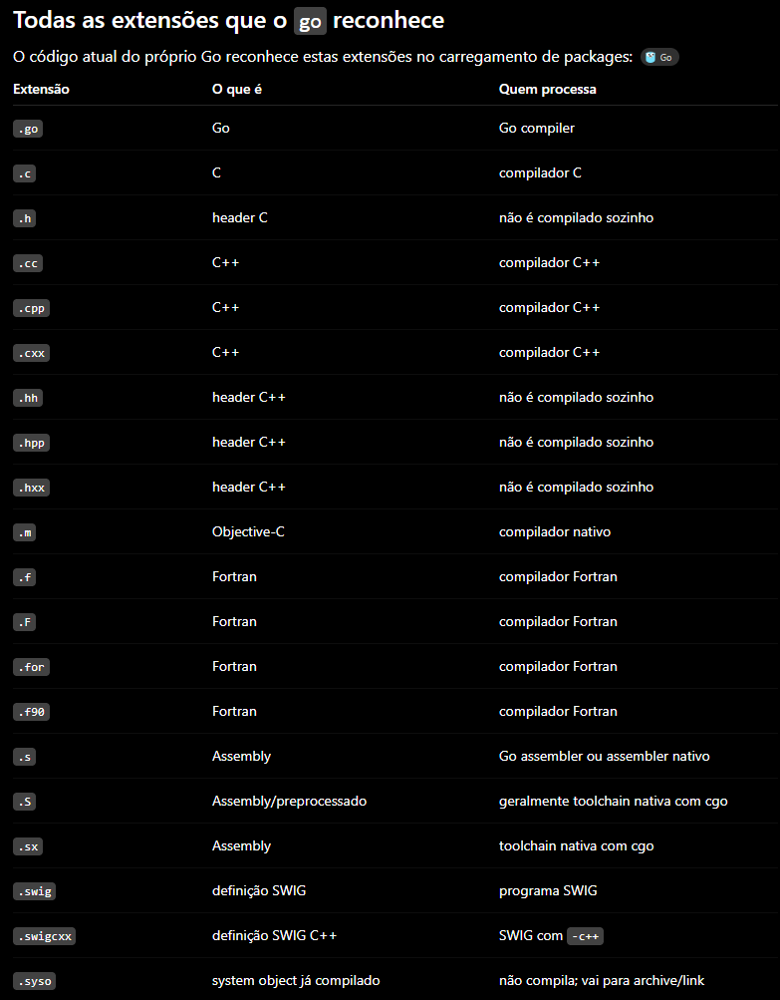

# Go Learning

Projeto simples para aprender a sintaxe de Go.

## A linguagem

**Escrita em**: Go foi boostrappado em C, então o primeiro compilador de Go foi escrito em C, depois foi reescrito em Go e foi utilizado esse compilador feito em C para compilá-lo e apartir dai as próximas versões foram escritas em Go e foi utilizado as versões anteriores para compilá-las.

**Convenção do nome de arquivos**:
    -Arquivos comuns: nomes curtos tudo minúsculo com ou sem snakecase e usando _ para sufixos especiais
        Sufixos especiais:(Esses sufixos esperam q a próxima coisa no nome do arquivo seja ".go")
            * _test: Explicado ali embaixo mas basicamente não entra na build e são arquivos de teste
            * _GOOS: Arquivos com "_OS" só são compilados se a variável GOOS conter esse mesmo nome de sistema operacional, como _windows, _linux, _darwin,...
            * _GOARCH: Mesma ideia do GOOS mas para arquitetura da CPU, ex.: _amd64, _risc64, _arm64, olha a variável GOOS dai.
            * _GOOS_GOARCH: Exige OS + Arquitetura ao mesmo tempo e da pra incluir _test no final para considerar arquivo de test
    -Funções: funções são em camelCase se forem exportados externamente ao package e PascalCase se forem exportadas externamente ao package
    -Test: Arquivos de teste devem terminar em "..._test.go" e  funções de teste devem seguir essa assinatura: func TestXxxx(t *testing.T). Arquivos de teste são ignorados na build
    -".": Arquivos que começam com . são ignorados pra build

## Conceitos úteis

**package**: Os códigos são organizados em pacotes, esses pacotes são determinados onde acabam e começam por pastas. Funções/Tipos/Variáveis/Constantes/Campos(dentro de tipos)  que começam com letra maiúscula são exportadas e outros pacotes podem usar, funções que começam em minúsculo são privadas somente ao contexto do package(pacote).

**Outros formatos além de .go**: O go aceita formatos de outras linguagens e suporte para usar outro compilador para compilar tudo e depois juntar usando o linker. Além disso, ele tem suporte nativo para .s para poder usar assembly no meio do código e também é possível usar arquivos/funções em C usando o cgo, usando import "C".

## Arquivos/Diretórios importantes

.       pacote atual
./...   todos os pacotes do módulo abaixo do diretório atual
all     todos os pacotes relevantes, incluindo dependências

**go.mod**: Arquivo para configurar o projeto e as dependências nele. É utilizado para indicar a versão da linguagem, caminho do projeto e indicar as bibliotecas externas que ele depende. Equivalente do package.json.

**main.go**: Apesar do nome do arquivo não importar, para um arquivo poder ser compilado e por tanto executado em Go é preciso que ele tenha package main e uma função main() sem parâmetros e sem retorno

**go.sum**: Arquivo que tem hashes criptográficos(checksums) das dependências externas baixadas pelo projeto. Ele serve pra garantir que uma dependência externa não foi alterada ou corrompida. Deve ser versionado no git. Não é um arquivo de lock, as versões das dependências continuam sendo determinadas pelo go.mod e pelo algoritmod e seleção de versões do Go.

**GOBIN**: Diretório onde go install coloca os executáveis compilados

## Comandos úteis

TEM COMO SALVAR O OUTPUT DE 1 COMANDO EM 1 ARQUIVO USANDO > (NOMEDOARQUIVO.EXTENSÃO)
EX.: ls > ./a.txt ou ls > /home/gabriel/projeto/docs/a.txt
go run . ou go run ./calculadora(diretorio caso dentro do diretorio tenha um package main com função main para ser executado)

**go mod tidy**: Comando que arruma/sincroniza as dependências do módulo.
    - Adiciona ao go.mod os módulos necessários pelos imports do projeto
    - Remove dependências que não tão sendo utilizadas
    - Adiciona dependências indiretas quando precisa
    - Cria ou atualiza o go.sum com os checksums pra verificar as dependências
    Flags:
        * -diff: Mostra o que go mod tidy alteraria sem alterar

**go build (PATH)**: Comando para compilar os pacotes apartir do path
    Flags:
        * -o: Escolhe o nome do executável(Código objeto) gerado

**go install .**: Comando que compila o módulo e instala ele no path, fica disponível pra ser executado apartir do nome do modulo, ex.: nesse caso seria go install e ai go-learning pq eh o nome do módulo. Instala no GOBIN. Também da pra usar para instalar programas publicados.

**which (nome-do-módulo)**: Comando que lista o path do binario de 1 programa instalado fora da pasta do próprio projeto.

**go list (. ou all ou diretorio)**: Comando usado pra retornar o nome do pacote do diretorio atual
    Flags:
        * -json: Aumenta os detalhes da listagem e lista em formato de json
        * -m: Lista módulos em vez de pacotes
        * -u: Procura updates disponíveis de módulos
        * -versions: Mostra versões existentes de um módulo
        * -compiled: Mostra os arquivos efetivamente enviados ao compilador
        * -export: Informa os arquivos no export/cache compilado
        * -deps: Mostra toda árvore de packages q o package depende e os packages q esse package depende

**go get (pacote@referencia)**: Comando para adicionar/atualizar dependências ao projeto, adiciona ao cache global do Go, se outro projeto pedir o mesmo pacote na mesma versão reutiliza e não baixa de novo. Os pacotes nunca são

**go clean**: Comando que limpa o executável criado no diretorio local.
    Flags: 
        * -modcache: Apague todo o GOMODCACHE que eh o teu cache global de pacotes Go instalados.
        * -cache: Apaga o cache global de compilação
        * -testcache: Invalida os resultados armazenados de testes, faz com que quando executando os testes novamente sem reutilizar resultado nenhum
        * -cache -testcache -modcache: combina tudo, da pra ver oq seria deletado com isso usando go clean -n

**go mod why (nome-do-modulo)**

**go mod graph**: Mostra as relações de dependência entre módulos, com uma aresta por linha

**go fmt**: Formata o código para o padrão da linguagem

**go test (diretorio base/...)**: Roda os testes, procura todos arquivos que possuam "..._test.go" no nome para executá-los, roda todos no diretorio base e se incluir "/..." depois do diretorio base, todos diretorios abaixo dele também
    Flags:
        * -race: Procura má utilizáção de memória que gera condição de corrida ao acesso de memória. Só os problemas de corridas q se originam quando roda o teste
        * -v: Detalha a saída
        * -run (NomeDosTestes): Só roda oq for específicado

**go doc (pacote.func ou só o pacote)**: Exibe a documentação da função ou do pacote, para documentar uma função do seu pacote, basta colocar 1 comentário diretamente em cima da função começando com o nome identificador dela em cima da função. Também é possível documentar o pacote em cima da declaração de package:
// Package calculadora ...(doc)
package calculadora
// Somar retorna a soma de a e b
Além disso, pode ser comentado com /* */ a doc
func Somar(a int, b int)...
    Flags:
        * -all: pega toda a documentação
            * EX.: go doc -all calculadora
        * -u: inclui tbm funções e coisas não exportadas

**go env (VARIAVEL1 VARIAVEL 2)**: Comando pra mostrar a configuração de ambiente usada pelo toolchain do go
    Flags:
        * -json: exibe como json tudo, se tu não colocar quais são as variáveis
        * -variaveis: GOOS, GOARCH, GOROOT, GOPATH, GOBIN, GOMOD, GOMODCACHE, GOCACHE, GOPROXY, GOPRIVATE

**go help (COMANDO)**: Serve para ver a documentação dos comandos úteis
